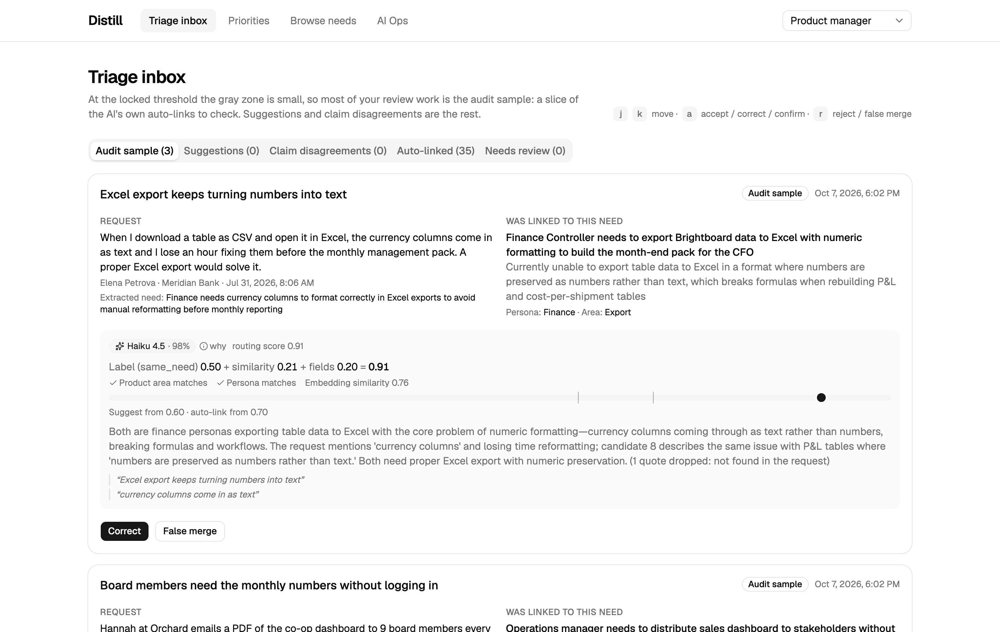
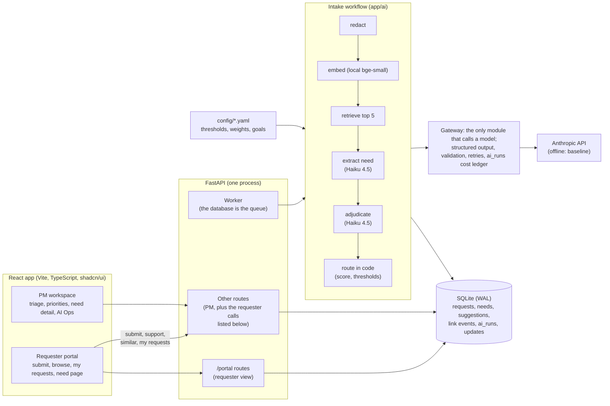

# Distill

**Distill turns raw feature requests into deduplicated, need-centric, prioritized product decisions, with a PM in the loop.** Each request is read by a fixed AI workflow as it arrives. The workflow extracts the underlying need (a problem for a persona), judges whether that need already exists, and links the request, suggests a link or opens a new need. Code, not the model, makes every routing decision, and every AI value shows its source, confidence and reason. The PM stops reading the stream: they review a small inbox of exceptions plus a 10% audit sample of the AI's own links. Built for the MetaCTO assessment ([brief](docs/assignment.md)). The CI is green ([latest run](https://github.com/ROBERTG99/MetaCTO-Assignment/actions/workflows/ci.yml)).



| | |
|---|---|
| **Problem** | Intake: duplicates, unclear needs and lost demand all start when a request arrives, and PMs spend their hours there ([spec §1](docs/spec.md#1-problem-and-thesis)). |
| **Who benefits** | PMs (an exception inbox instead of the stream), requesters (find and back an existing need; hear back when it's decided), CS and sales (accounts and renewals behind each need), product leaders (popular kept apart from strategic). |
| **AI design** | A fixed workflow with two model steps (extract, adjudicate) on **Haiku 4.5**, chosen by eval: **91.3%** on the frozen test set, against **71.3%** for the no-LLM baseline and **74.7%** for Sonnet 5.5. |
| **Human judgment** | Gray-zone links, claim disputes, the audit sample, undo, every need's status, every message to a customer. |
| **Measured** | Triage effort (M1), duplicate rate (M2), decision-loop latency (M3), audited false merges against a 3% target (M4), all on the AI Ops page. |

## Quick start (offline, no API key)

```bash
make setup   # Python deps (uv), the local embedding model (64 MB), npm deps, Playwright's Chromium
make seed    # the Brightboard demo data, with recorded Haiku 4.5 output: no key, no API calls
make dev     # API on :8000 (with its worker) and the web app on http://localhost:5173
```

`make demo` does all three. Use the role switcher (top right) to act as a requester or as a PM. Everything runs offline by default (`AI_MODE=offline`): new submissions are routed by the embedding baseline, and the seed shows real model output recorded from the evals. Strategic fit isn't rated offline yet: its recorded ratings come from the labelled fit eval, which hasn't run, so seeded needs show "Not rated", needs changed offline show "Pending" (they are rated only in live mode), and the strategic side of the quadrant is empty. CI runs the parts of `make check` (lint, types, 400+ tests), `make e2e` (6 Playwright golden paths) and `make eval-gate` (free offline evals), plus the build and dependency audits.

## Answers to the brief

| The brief asks | One line | Where |
|---|---|---|
| The business problem | Requests describe solutions; the unit of value is the need. Intake is where duplicates and lost demand start, so that's where AI goes. | [Problem](#the-problem-and-why-intake) |
| Who benefits | PMs, requesters, CS and sales, product leaders, each with a concrete before and after. | [Who benefits](#who-benefits) |
| Why AI | Telling needs apart is about meaning, not words: Haiku beats the embedding baseline by 20 points on test, and keeps genuinely new needs new 100% of the time against 25%. | [AI design](#ai-design) |
| How AI changes the workflow | The PM no longer reads every request; the workflow links, suggests or opens needs, and the PM handles exceptions and an audit sample. | [Before and after](#the-workflow-before-and-after) |
| The architecture and why | A code-orchestrated workflow, not an agent: the path is the same for every request, so each step is testable, costed and evaluated on its own. | [Architecture](#architecture), [ADR 0001](docs/adr/0001-workflow-first-one-bounded-agent.md) |
| Where human judgment stays | Status decisions, gray-zone links, claim disputes, the audit sample, undo, and approving every message to a customer. | [Human judgment](#where-human-judgment-stays) |
| How to measure impact | M1 to M4, computed from the rows the app writes, shown on AI Ops; M4 has a Wilson interval against a 3% target. | [Success metrics](#success-metrics) |
| Assumptions, risks and tradeoffs | Synthetic data, an auto-link threshold that links every same_need label, a known persona failure, no auth yet, and more, each with a fix. | [Tradeoffs and risks](#tradeoffs-assumptions-and-risks), [Production path](#production-path) |

---

## The problem, and why intake

Brightboard (a fictional B2B analytics SaaS) gets requests from customers, prospects, support, sales and internal teams. Almost every pain in the brief starts at intake. Duplicates enter there, demand splits across five phrasings of one need, PMs spend their hours there, and nobody can tell a customer anything until requests are organized. The thesis is that **requests describe solutions; the unit of value is the need, a problem for a persona.** "Excel export" from a finance lead and "Excel export" from an IT admin are two different needs, while "scheduled email", "weekly PDF" and "Slack digest" are one need. Once intake holds that line, prioritization and stakeholder updates are thin layers on top. ([spec §1-§3](docs/spec.md))

## Who benefits

| Who | Today | With Distill |
|---|---|---|
| PM | Reads every request, searches by keyword, merges by hand | Reviews the gray zone, disputes, failures and a 10% audit sample; ranks with an explained score |
| Requester (customer, CS, sales, internal) | Submits into a void; duplicates are invisible | Sees matching needs while typing, backs one in a click, follows their request, gets a personal update when it's decided |
| CS and sales | Can't see which accounts want what | Sees accounts, ARR and renewals behind each need, and a CS note per account when a decision lands |
| Product leader | Vote counts or opinions | Demand, strategic fit and urgency shown separately; popular kept apart from strategic |

## The workflow before and after

| Step | Before | After (who does it) |
|---|---|---|
| Submit | A form into a list | The form shows the closest existing needs as you type (embeddings, no LLM); "this is my need" adds support |
| Dedupe | The PM spots duplicates from memory | Retrieval finds candidates, the model judges same need or not, code routes: auto-link, suggest, or new need (AI and code) |
| Understand | The PM rereads the thread | The extraction stores problem, persona, job to be done, area and severity, with confidence and rationale (AI) |
| Weigh | Vote count | Demand from ARR and segments, urgency from severity and renewals (code); strategic fit per goal (AI, rated 0 to 3; code weighs it) |
| Decide | Spreadsheet triage | The PM works an exception inbox and sets each need's status with a reason (human) |
| Communicate | Ad hoc, often never | AI drafts a personal update per supporter and a CS note per account; code flags promises; the PM approves each one (AI and human) |

## Architecture



- **One process, by design.** The API, the worker and SQLite run together; the request row is the job (pending, processing, processed or needs review), with retries and a lease ([ADR 0007](docs/adr/0007-database-as-queue.md), [ADR 0005](docs/adr/0005-sqlite-now-pgvector-later.md)).
- **AI never blocks a submission.** A request is saved before any model call; if the provider fails or refuses, it goes to the PM's Needs review with the reason.
- **A requester view apart from the PM view.** Requester pages read needs through `/portal`, which carries no revenue, accounts, descriptions or internal notes. Their other calls (`POST /requests`, `POST /needs/{id}/support`, `GET /needs/similar`, `GET /requests?requester_id=` and `GET /requesters`) sit outside `/portal` and will need scoping to the signed-in requester. `/healthz` and `/readyz` are public (production path #10 moves `/readyz` details inside); every other route is PM-only ([ADR 0011](docs/adr/0011-production-hardening-portal-split-limits-tracing.md)).
- More: [docs/architecture.md](docs/architecture.md), [ADRs](docs/adr/).

## AI design

**A workflow, not an agent.** Intake is the same steps for every request, so a model choosing the path would add cost, latency and variance, and make each step impossible to evaluate on its own ([ADR 0001](docs/adr/0001-workflow-first-one-bounded-agent.md)). The one place an agent fits, an overlap finder that would feed a decision brief (spec F6), was designed with read-only tools and a step cap, and was cut for time; no agent is in the product. The other model steps are single calls in code-orchestrated workflows:
- **Intake:** extract, then adjudicate against retrieved candidates.
- **Strategic fit:** rate each goal 0 to 3 ([ADR 0009](docs/adr/0009-weighted-priority-computed-on-read.md)).
- **Stakeholder updates:** draft messages ([ADR 0010](docs/adr/0010-stakeholder-updates-ai-drafts-code-checks-pm-approves.md)).

**The model judges, code decides.** Models return labels, extracted fields, ratings and drafts; thresholds, routing scores, priorities and permissions are code and config. Every call goes through one gateway: structured output validated with Pydantic, user text inside XML tags as data, emails and phones redacted, one repair retry, refusals as failures, and a row in `ai_runs` with tokens, cost, latency and outcome ([ADR 0003](docs/adr/0003-model-judges-code-computes.md), [ADR 0008](docs/adr/0008-model-boundary-details.md)).

**Models chosen by eval, against a no-LLM baseline** ([REPORT §3](evals/REPORT.md#3-model-strategy-comparison-2026-10-07), [ADR 0006](docs/adr/0006-per-step-model-choice-by-eval.md)). The frozen test set has 150 cases, 17 of them written by hand as hard cases; dev is a replay of the 62 seed requests.

| On the frozen test set (n = 150) | Accuracy | Duplicate precision | Duplicate recall | New needs kept new | $ per request |
|---|---|---|---|---|---|
| Baseline (embeddings and thresholds, no LLM) | 71.3% (64-78) | 71.6% | 80.8% | 25% | 0 |
| **Haiku 4.5, both steps** | **91.3% (86-95)** | 97.4% | 90.4% | 100% | 0.0060 |
| Sonnet 5.5, adjudication | 74.7% (67-81) | **100.0%** | 69.6% | 100% | 0.0112 |

- **Haiku 4.5, because it won where the choice was made.** On dev, Haiku and Sonnet overlapped (82.3% against 74.2%), so the simpler and cheaper option won: one model for both steps at about half the cost. Test confirmed it with room to spare.
- **Why Sonnet's perfect precision lost.** It never false-merged (0 of 87 links), but paid with recall of about 70%. When the requester's persona differed from the need's, it labelled true duplicates `related`, and it sent 63 of 150 requests to new needs where 25 belong. With this prompt it doesn't beat the baseline on accuracy on either split; it wins only on false merges. Under the project's rule that an LLM step must beat the baseline to earn its cost, Sonnet didn't, and Haiku did.
- **Why the cascade wasn't built.** A cascade would send Haiku's gray zone to Sonnet. On that band, Sonnet is the weaker judge: 72% against Haiku's 96% on dev, and 72% against 97% on test. The simulated cascade reached 72.6% on dev, below Haiku alone (82.3%), at a cost in between.
- **Spend.** The whole model comparison cost **$5.88** for 971 calls. That includes $0.91 to re-run dev after a review found a label leak in the replay (see risks). Every reply is cached, so the report regenerates for free.

## Where human judgment stays

| Decision | Who | Why |
|---|---|---|
| Auto-link above the threshold | AI, labelled and undoable; 10% sampled for audit | High precision expected; the audit measures it |
| A link in the gray zone | Suggested; the PM decides | Errors there are costly and uncertain |
| A requester's "this is my need" | Checked by the workflow; disputes go to the PM | Requesters over-claim; an unchecked claim is a merge |
| A need's status (planned, declined…) | The PM, with a reason | It's a product decision |
| Messages to customers | AI drafts, code flags promises, the PM edits and approves each one | They're external commitments |
| Thresholds, weights, goals | The PM in config, after an eval | The model judges, code decides |

## Guardrails

- **The audit sample.** 10% of auto-links (a stable hash, not a random draw) go to the PM's audit tab first. Its false-merge rate is M4, measured on real traffic.
- **Reversible by design.** Every link can be undone in one click. History is append-only (`linkevent`), and nothing the AI produced is deleted.
- **Prompt injection is contained.** User text is passed as data inside tags, the intake path has no tools that write, quotes are verified in code, and a request that tries to give orders can at worst cause a wrong suggestion that a human reviews.
- **Stakeholder messages can't over-promise.** A code check flags dates, timing and "we will ship" unless the PM set a date. Approval re-checks the text and refuses while anything is flagged.
- **Failure is visible, not blocking.** Provider errors retry with backoff, then go to Needs review with the reason. A daily model-spend ceiling makes the worker wait instead of spending.
- **Production hardening.** Rate limits, body caps, CORS, request IDs into `ai_runs`, health and readiness endpoints, and logs scrubbed of PII ([details](#production-path)).

## Success metrics

| Metric | Definition (computed from rows the app already writes) | Target or baseline |
|---|---|---|
| M1 Triage effort | Share of finished requests no PM had to touch (no PM link or decision, no open suggestion, no failure); also PM minutes per 100 requests | Today a PM reads 100% (assumption) |
| M2 Duplicate rate | Deflection: supports added at the door ÷ (supports + new requests). Leakage: new-need requests a PM later moved to an existing need (structurally 0 until a manual relink action exists) | About 30% of requests are duplicates (assumption) |
| M3 Decision-loop latency | Median time from a status change to the last supporter's update approved | 14 days today (assumption) |
| M4 False merges (guardrail) | Audited auto-links marked false merge ÷ audited auto-links, with a 95% Wilson interval | ≤ 3% |

All four, plus acceptance rate, needs-review rate, cost, latency and queue health, are on the **AI Ops** page and `GET /metrics` ([spec §10](docs/spec.md#10-success-metrics)).

## Evals

- **Free, in CI.** `make eval-offline` runs the embedding baseline, and `make eval-gate` checks it against committed floors.
- **Paid, and asks first.** `make eval` runs the model strategies on dev and test, with every reply cached.
- **Results:** [evals/REPORT.md](evals/REPORT.md). §1 is the baseline, §3 the strategy comparison, §4 the decisions.
- **The datasets:**
  - the test set is frozen: SHA-256 recorded, and the runner refuses to run otherwise;
  - the hard cases were written by hand;
  - strategic-fit cases (10 seeded needs plus one injection case) wait for human labels before their paid run (about $0.07).

## Tradeoffs, assumptions and risks

| | What | Evidence | Fix |
|---|---|---|---|
| **Synthetic data** | Brightboard, the seed and 133 of the 150 test cases were written by the team that built the system, so the evals measure agreement with the author's labels, not with real customers. | REPORT §1 | A pilot with real requests, labelled by a PM who didn't build it. |
| **The auto-link threshold** | T_auto = 0.6953 equals the lowest score Haiku gave any same_need label on dev. In practice every same_need label auto-links, and the score's weights are still placeholders. On test: 97.3% precision, 87% of true duplicates auto-linked, 3 unreviewed false merges (1 at 0.90). The point estimate (2.7%) is inside the 3% target, but the 95% interval reaches about 8%. | REPORT §3, §4.2 | The protection is the audit sample and one-click undo, not the score. 0.90 would auto-link only a third of duplicates. Re-tune once dev has hard cases. |
| **Persona over-splitting** | 11 of Haiku's 13 test misses split a need when the requester's persona differs from the need's. | REPORT §3, §4.4 | `adjudicate_v2` is proposed with ship criteria, not yet evaluated (about $0.80). |
| **Disputed labels** | Two frozen test labels (T050, T065) are arguable. Under the other reading Haiku goes from 137 to 139 of 150. | REPORT §4.5 | A human decision, recorded as a new frozen set, never an edit of v1. |
| **Dev label leak (caught and fixed)** | The first dev replay showed the adjudicator example titles that included the item's own title. A review caught it; dev was re-run (126 calls, $0.91); test was unaffected. | REPORT §3 | Fixed; dev examples are snapshotted per item. |
| **Spanish recall** | The embedding model is English-only; a Spanish request finds its need first 1 time in 4. | REPORT §1 | Evaluate a multilingual embedder on a Spanish slice of 20 or more cases. |
| **Dev has no hard cases** | The threshold isn't stress-tested where it matters; the dev-tuned baseline failed on test exactly there. | REPORT §1, §3 | 25+ hand-made hard cases for dev, then choose T_auto again. |
| **Assumptions** | English requests, a backlog under about 10K requests, no auth (a role switcher), one PM team, about 2,000 requests a month, 2 minutes of PM time per request today. | [spec §13](docs/spec.md#13-assumptions) | |

Further tradeoffs are recorded in each ADR's Consequences.

## How it was built with AI

Every prompt is in [prompts.txt](prompts.txt), and hooks write a raw audit trail to `prompts.audit.jsonl`. [docs/ai-development.md](docs/ai-development.md) covers the rest:
- the Claude Code harness, where CLAUDE.md is guidance and hooks are guarantees;
- test-first and eval-first work, with real red-to-green examples;
- how the evals changed decisions;
- what was decided by a human;
- where the AI got it wrong.

## Production path

What would block this from going to production at a real client, ranked by risk. Estimates are for one engineer who knows the codebase. Fixed items were done in the "production hardening" step and are tested (`backend/tests/api/test_hardening_api.py`, `test_portal_api.py`) and run in CI.

### Still open

| # | Risk | Why it blocks | What to do | Estimate |
|---|---|---|---|---|
| 1 | **No authentication or authorization.** The role switcher lets anyone act as any requester or as a PM: approve messages to customers, change statuses, read the PM routes (accounts and ARR, request descriptions, the outbox, AI Ops), and submit or support as anyone. | Unauthorized access and external messages | OIDC SSO, with roles requester, PM and CS. Scope `/portal` and the requester routes (`POST /requests`, `POST /needs/{id}/support`, `GET /needs/similar`, `GET /requests?requester_id=` and `GET /requesters`) to the signed-in requester, and guard every other route as PM-only. | 2–3 days |
| 2 | **No PM override for strategic-fit ratings** (ADR 0009). The model's 0–3 rating per goal is applied directly and is worth up to 40 priority points; a PM can't correct it, only read its rationale and quote. | A wrong or injected rating moves the ranking | An appended PM rating with an actor, which wins over the model's, plus a "re-rate" action. | 0.5 day |
| 3 | **Single tenant.** | One client's data visible to another | A tenant id on every table, with row-level filtering. | 2 days |
| 4 | **SQLite, an in-process worker, no schema migrations, no backups.** `make seed` drops and recreates tables, so any schema change needs a reseed (local data is lost). | Data loss on deploy; one process only | Postgres with Alembic, the worker as its own process (`SELECT … FOR UPDATE SKIP LOCKED`), pgvector (ADR 0005), and backups with a restore drill. | 2–3 days |
| 5 | **Rate limits are in memory, per process.** | Limits multiply with replicas | A shared store (Redis) for the write budget and the public-write rate. Run uvicorn with `--forwarded-allow-ips=<proxy>`, so limits key on the real client and not the proxy. | 0.5 day |
| 6 | **Names and request text go to Anthropic** (emails and phones are redacted). | Needs a DPA and zero data retention, or name redaction | A DPA and ZDR, plus optional redaction of person names. | 0.5 day plus legal |
| 7 | **The outbox is simulated.** | Updates never reach customers | Email or Slack delivery from the outbox, with retries, bounces and unsubscribe. | 1–2 days |
| 8 | **No alerting or tracing.** Logs are JSON with request IDs, and `/readyz` exposes queue health, but nothing pages anyone. | Failures go unnoticed | Ship logs (e.g. Datadog), OpenTelemetry traces, alerts on stuck jobs, needs-review rate, spend and 5xx. | 1 day |
| 9 | **No eval for `stakeholder_update_v1`** (the code commitment check and PM approval are the safety net); strategic-fit labels are waiting on a human; no injection slices for fit or updates. | Prompt quality unproven | Labelled cases for each, then the paid runs (about $1). | 0.5 day |
| 10 | **Internals are public:** `/metrics` and `/readyz` details, and the docs (off with `DOCS_ENABLED=false`). | Information leak | Serve `/readyz` details and `/metrics` on the internal network or behind PM auth. Turn docs off in production. | 1 hour |
| 11 | **No TLS or HSTS in the app.** | Transport security | Terminate TLS at the proxy and set HSTS there. | 1 hour |
| 12 | **Retention, deletion and export (GDPR).** | Compliance | Retention windows for ai_runs and requests, plus delete and export per person. | 1 day |
| 13 | **Lists cap at 100 needs.** The priorities table and Browse's product-area filter fetch at most 100 needs and filter in the browser; search is brute force, fine up to about 10K requests (ADR 0005); no load test. | Rankings silently incomplete past 100 needs; a performance cliff | Server-side multi-status filtering and paging for the ranked table, a product-area list endpoint, pgvector, a load test with k6 and an SLO. | 1 day |
| 14 | **Request IDs supplied by a client are trusted** (validated for format only). | Muddied traces | Trust the header only from the proxy, or prefix it with a server ID. | 30 min |
| 15 | **Phone layout and accessibility not checked.** Pages were built and tested on a desktop viewport with accessible names and roles (the e2e specs rely on them), but no phone-width pass and no audit (axe, keyboard-only, screen reader). | Unusable for some users | An axe run in CI, a keyboard and screen-reader pass, and responsive fixes at 375 px. | 1 day |

### Fixed in the hardening step

| Risk | Fix |
|---|---|
| **Public writes unthrottled.** Each one becomes paid model calls. | **Per-client limits:** 30 per minute on `POST /requests` and `POST /needs/{id}/support`, matched by route so `/needs/+1/support` can't bypass it. A 120-per-minute budget covers every write by method. `429` responses carry `Retry-After`. |
| **Unbounded spend.** | The worker stops claiming jobs once today's model spend reaches `DAILY_MODEL_BUDGET_USD` (default $20). Jobs wait; nothing is lost. |
| **Request size.** | Every field is capped, and bodies are capped at 64 KB (`413`; `411` for chunked bodies). |
| **CORS and headers.** | CORS allows only `WEB_ORIGINS`. Every response, 500s included, has `nosniff`, `X-Frame-Options: DENY`, `Referrer-Policy: no-referrer` and `Cache-Control: no-store`. |
| **Secrets and PII in logs.** | JSON or text logs, both scrubbed of keys, emails and phones. Uvicorn's access log, which prints query text, is replaced by ours (method, path, status, duration). The email regex is linear time; it had been an O(n²) DoS through long URLs. |
| **No tracing.** | **Request IDs:** an `X-Request-ID` follows a submission through the queue onto its `ai_runs` (`Request.trace_id`, `AIRun.trace_id`). |
| **No health or queue visibility.** | `/healthz` and `/readyz` (database, AI dependencies, worker; `503` when not ready). Queue depth, stuck claims past the lease and pending background jobs appear in `/readyz` and on AI Ops. |
| **PM-only data in the requester portal.** | Requester pages read needs through `/portal/...`, which has no revenue, accounts, request descriptions, other people's reasons, internal notes or audit trail. My requests shows only the requester's own requests. Requesters see a plain needs-review reason instead of internal errors. |
| **Repair turns echoed model output.** | Validation repairs send field locations and messages only. |
| **Gaps in the UI.** | **Gap fixes:**<br>- My requests stops polling after 2 minutes and marks a request "Stuck" (pure logic unit-tested with Vitest);<br>- the requester need page refreshes every 10 s and on focus, so an approved update appears without a reload (checked in e2e GP5);<br>- a provider-failure e2e spec (GP6) runs through a fault switch that exists only with `APP_ENV=test`;<br>- the bundle is code-split by role, with vendor chunks; the largest is 312 kB (98 kB gzipped), down from one 531 kB file. |
| **No CI or dependency checks.** | **CI** (`.github/workflows/ci.yml`, offline and free):<br>- ruff, strict mypy, pytest, the hook tests with ruff required;<br>- the offline eval gate (`evals/gates.yaml`);<br>- pip-audit and `npm audit` on production dependencies;<br>- the frontend typecheck and build;<br>- Playwright.<br>Actions are pinned to SHAs, and Dependabot runs weekly. |
