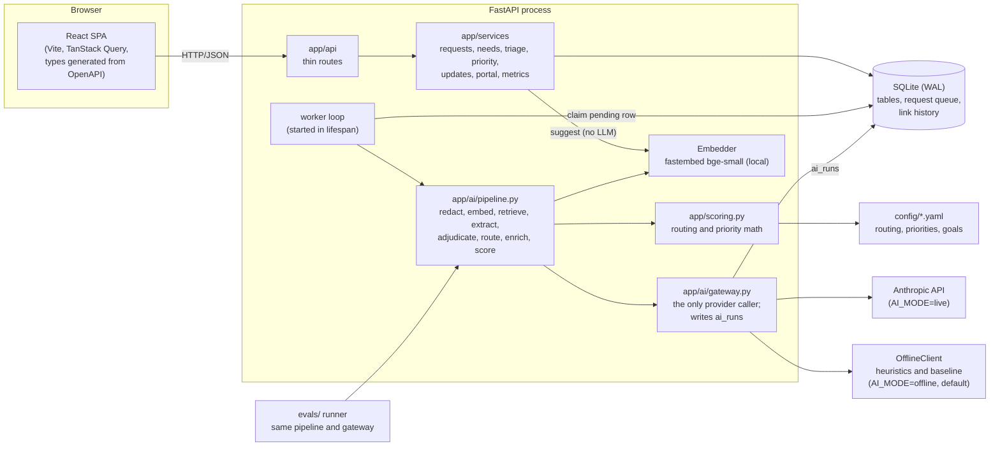
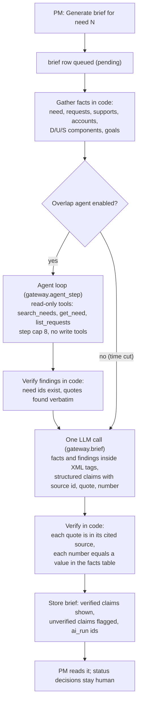

# Architecture

Product behavior: [spec.md](spec.md). Decisions: [adr/](adr/). Paths follow the architecture map in CLAUDE.md. `config/` sits at the repo root, so the backend and the evals read the same thresholds and weights.

## Components



- **One process.** The API, the worker loop and SQLite all run in one process (ADR 0005, ADR 0007). The worker code doesn't depend on the web layer, so it can later run as its own process.
- **Gateway.** It exposes one method per model step: `extract`, `adjudicate`, `rate_fit` and `draft_updates`. It redacts emails and phone numbers in every input before any provider call (rule 9). Clients are `AnthropicClient`, `OfflineClient` (heuristics, the baseline, template drafts), `FakeLLM` in tests and `FaultInjectingClient` (only with `APP_ENV=test`, for the e2e failure path) (ADR 0006, ADR 0008). Prompts live in `app/ai/prompts/<step>_v<N>.md`.
- **Vectors.** They aren't stored: at startup the index embeds every member request and need with the local model into one numpy matrix, and updates it on write. Search is brute-force cosine (ADR 0005).

## Intake sequence (through the database queue)

```mermaid
sequenceDiagram
  actor R as Requester
  participant UI as SPA
  participant API as FastAPI
  participant DB as SQLite
  participant W as Worker loop
  participant P as Pipeline
  participant G as Gateway
  participant M as Model provider

  R->>UI: types title and description
  UI->>API: GET /needs/similar?q=... (debounced)
  API->>API: embed + numpy search (no LLM, under 300 ms)
  API-->>UI: top 5 needs (problem plus persona)
  alt "This is my need"
    R->>UI: claim need N, with why and severity
    UI->>API: POST /needs/N/support
    API->>DB: support(claimed) + LinkEvent(link, requester_claim)
    API-->>UI: 201 (or 200 on a repeat); counted only once confirmed
  else New request
    UI->>API: POST /requests
    API->>DB: request(pending)
    API-->>UI: 201 (saved before any model call)
  end
  W->>DB: claim the oldest pending row (processing, attempts+1, claimed_at)
  W->>P: run(request)
  P->>P: embed redacted text, retrieve top 5 needs (+ the claimed need)
  P->>G: extract (text inside XML tags)
  G->>M: structured output call
  M-->>G: parsed result, or refusal / error
  Note over G: max_tokens or validation error: one retry inside the gateway
  G->>DB: ai_run (tokens, cost, latency, outcome)
  P->>G: adjudicate against candidates
  G->>M: structured output call
  G->>DB: ai_run
  P->>P: verify quotes, route (score vs thresholds), enrich, score
  alt success
    W->>DB: one transaction: AI fields, need_id, aisuggestion, LinkEvent, status processed
  else transient error, attempts < N
    W->>DB: back to pending with backoff, last_error
  else refusal, second max_tokens or validation failure, or attempts = N
    W->>DB: request needs_review (reason)
  end
  Note over W,DB: On startup, every processing row goes back to pending (lease 0: one process).
```

## Decision brief with the overlap agent (designed, not built)

Not built: the brief (F6) and its overlap agent were cut for time, so the product has no agent (ADR 0001 outcome). The design is kept for the production path.



The brief is a workflow, because its inputs are known in advance. The agent is the only step whose path isn't known ahead of time: which needs to search for depends on what it finds. That is why it would have been the only agent (ADR 0001).
