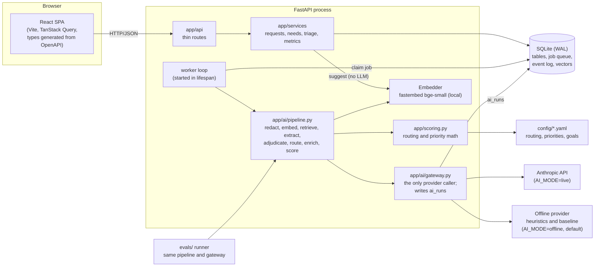
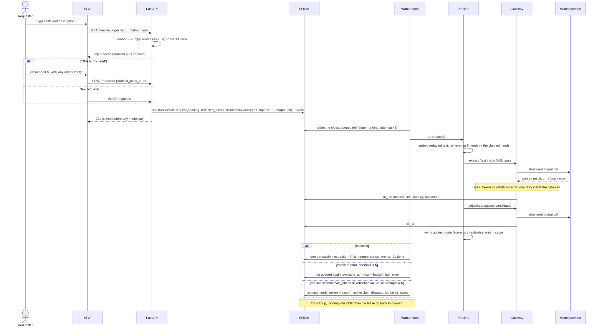
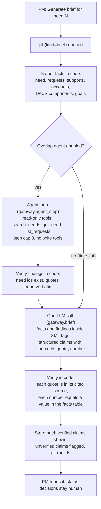

# Architecture

Product behavior: [spec.md](spec.md). Decisions: [adr/](adr/). Paths follow the architecture map in CLAUDE.md. `config/` sits at the repo root, so the backend and the evals read the same thresholds and weights.

## Components

- **One process.** The API, the worker loop and SQLite all run in one process (ADR 0005, ADR 0007). The worker code doesn't depend on the web layer, so it can later run as its own process.
- **Gateway.** It exposes `extract`, `adjudicate`, `rate_fit`, `brief` and `agent_step`. It redacts emails and phone numbers in every input, including agent tool results, before any provider call (rule 9). Providers are AnthropicProvider, OfflineProvider, and FakeLLM in tests (ADR 0006). Prompts live in `app/ai/prompts/<step>_v<N>.md`.
- **Vectors.** They are float32 BLOBs in the `embedding` table, loaded into one numpy matrix at startup and updated on write. Search is brute-force cosine (ADR 0005).

## Intake sequence (through the database queue)

## Decision brief with the overlap agent (should)

The brief is a workflow, because its inputs are known in advance. The agent is the only step whose path isn't known ahead of time: which needs to search for depends on what it finds. That is why it is the only agent (ADR 0001).
